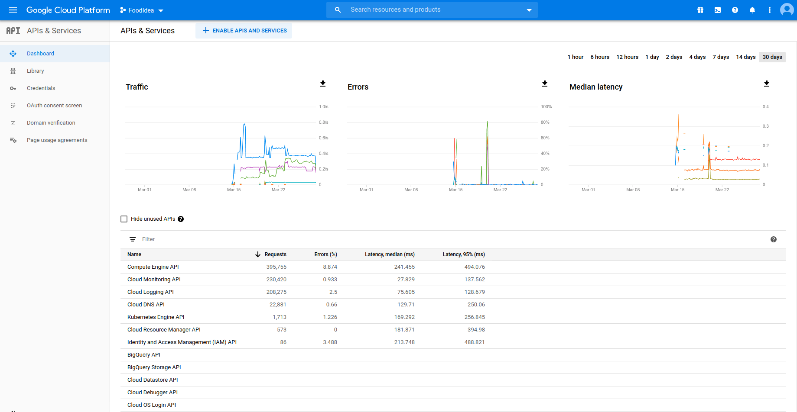
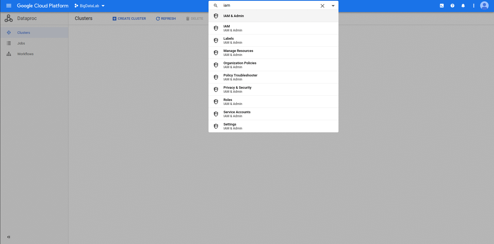

# Cloud native workshop

## Setup GCP

1) Enable following Google Cloud APIs in your GCP project. Use the Big Data project that we use during classes  

```none
* Compute Engine API
* Cloud Monitoring API
* Cloud Logging API
* Kubernetes Engine API
* Cloud Resource Manager API
* Identity and Access Management API  
```



2) Create serviceaccount for terraform in the project. Download json keys



## Terraform

1) Clone this repo. Place downloaded json key file inside the `1-CloudNative/terraform` dir. Run an interactive session into the container based on image you created in step 0. **Mount your container home dir (should be `VOLUME`) to the directory that contains this repo**

```bash
sudo docker run -it -v "<PATH_TO_REPO_ON_HOST>:<PATH_TO_CONTAINER_HOME>" cloud-native
```

2) Enter `terraform` folder. Initialize terraform. Examine `terraform.tfvars` and modify them. **Make sure that the `project_id` corresponds to your GCP project ID!** Run `terraform plan` with json keys.

```bash
cd 1-CloudNative/terraform
terraform init
GOOGLE_APPLICATION_CREDENTIALS=<path_to_your_json> terraform plan
```

3) Examine the plan created by terraform. Run `terraform apply` with json keys. Answer `yes` to the question - your cluster should be ready in approx 10 minutes.

## Kubernetes - first steps

1) Copy the generated Kubernetes config to access the cluster

```bash
mkdir -p ~/.kube
cp config ~/.kube/config
```

2) Inspect the api-resources and objects deployed in the fresh cluster

```bash
kubectl api-resources
kubectl get namespaces
kubectl get pods -n kube-system
```

3) Create new namespace for out sample app

```bash
kubectl create namespace sample-app
```

4) Inspect the objects (deployment, service). See how they are meant to interact with each other

5) Apply the objects in the namespace. Inspect the running pods.

```bash
kubectl apply -f service.yaml -n sample-app
kubectl apply -f deployment.yaml -n sample-app

kubectl get pods -n sample-app
```

6) Inspect the service. What kind of IP address was assigned to it? Connect to the pod using port-forward. You should be able to curl inside

```bash
kubectl get services -n sample-app
kubectl get pods -n sample-app
kubectl port-forward pod/<pod_name> 8080:8080 -n sample-app &
curl localhost:8080
```

## Kubernetes - operations

1) Remove the service and modify it to be `LoadBalancer`. Wait a moment for Google Cloud LoadBalancer to make its magic. What kind of IP address was assigned to it? Type the address in your browser. Can you access the app?

```bash
EDITOR=nano kubectl edit service/example -n sample-app
kubectl get services -n sample-app
```

2) Edit the running deployment. Increase number of replicas (eg, 10). Wait for the pods to spawn. Why it took so long? Mind the `resources` section. See the nodes of your cluster. What happened? Check, which pod is running on which node

```bash
EDITOR=<editor_of_your_choice> kubectl edit deployment/example -n sample-app
watch kubectl get pods -n sample-app
kubectl get nodes
kubectl get pods -o wide
```

3) Perform several maintenance operations: describe pods, get the yaml object dump, watch container logs, exec into the running container

```bash
kubectl get pods -n sample-app
kubectl describe pods/<pod_name> -n sample-app
kubectl get pods/<pod_name> -o yaml
kubectl logs <pod_name> -c <container_name> -f
kubectl exec -it <pod_name> -c <container_name> /bin/bash
```

4) Then, bump a version to `2.0`. Watch how rolling update performs its work

```bash
EDITOR=<editor_of_your_choice> kubectl edit deployment/example -n sample-app
watch kubectl get pods -n sample-app
```

## Helm

1) Enter the `helm` folder containing the KubeInvaders chaer

```
cd ~/1-CloudNative/helm
```

2) Create new namespace for KubeInvaders:

```
kubectl create ns kube-invaders
```

3) Inspect a helm chart. Install kube invaders from the helm chart, set config to point to your `sample-app`. Inspect the template to see what was generated

```bash
cd helm
helm install kubeinvaders . -n kube-invaders
```

4) Due to bug in kubeinvaders (or rather - our lack of domain) we have to wait for loadbalancer to establish new IP address, and then update the installment using this ip address. Edit the `values.yaml` file with the LoadBalancer IP and then upgrade the helm deployment

```bash
helm upgrade kubeinvaders . -n kube-invaders
```

5) Play kube-invaders. At the same time, observe how your application survives the fatality. Congratulations! You know how to deploy and manage a simple kubernetes app! Consider installing some [helm/stable](https://github.com/helm/charts/tree/master/stable) chart (wordpress? minecraft?) to test your cluster on software you know.

## Cleanup

1) Move back to the terraform. Execute `terraform destroy`, and accept changes. All the changes we made to your GCP project during this workshop should disappear in a couple of minutes.

2) Stop the container, remove it. Keep the image and terraform files, we will use them in the next workshop

## Extras and where to go next in Kubernetes world:

Three words for each:

* [Istio](https://istio.io/)
* [Operators](https://coreos.com/operators/)
* [KNative](https://knative.dev/)
* [Kubeflow](https://www.kubeflow.org/)